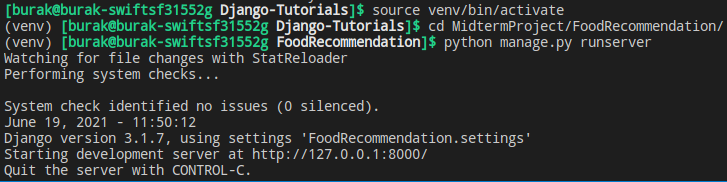

# whatshouldieatoday-foodrecommendationapi
Food recommendation api coded via Python/Django Rest Framework

----------------------------------
Content-based filtering : This recommendation type looks at the contents of the meals you have eaten in the past and offers you suggestions accordingly.

Collaborative filtering : This recommendation type offers a recommendation by comparing you with people with the closest taste to you.
-----------------------------------

We should go to the root folder of the project and write "source venv/bin/activate" and go to the virtual environment part.
In this part, the following step may not be necessary since django and rest framework are already installed in this project.
    If not;
    "pip install django
    pip install djangorestframework"
    We need to install django by typing commands.
Again, as a basic command;
    "pip install PACKAGE"
    For example, using the logic;
    using "pip install sklearn" we can use one of the libraries needed for recommendation systems
    
After all the packages are installed, to start the project, come to the "manage.py" section with the Change Directory commands:
    You can start the project with "python manage.py runserver", to create a Super user;
    We can create an admin with "python manage.py createsuperuser".
    
Here is an example for starting the project.

